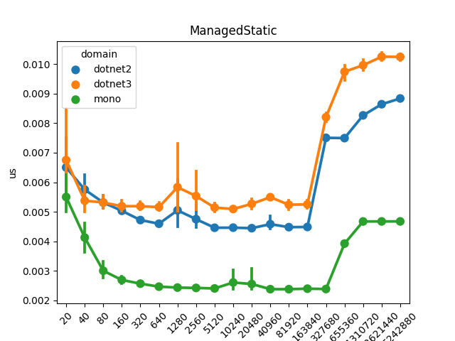
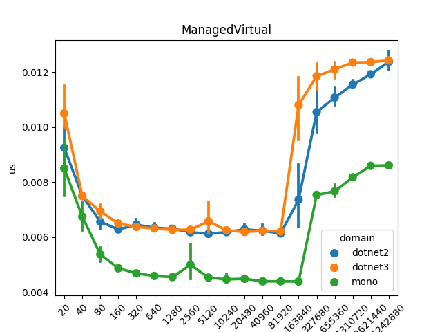
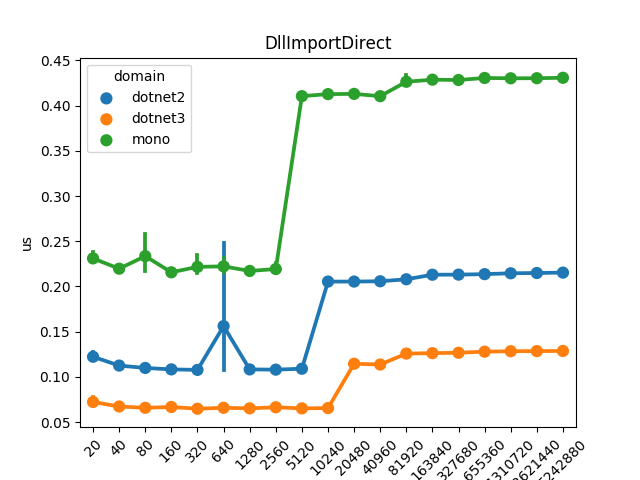
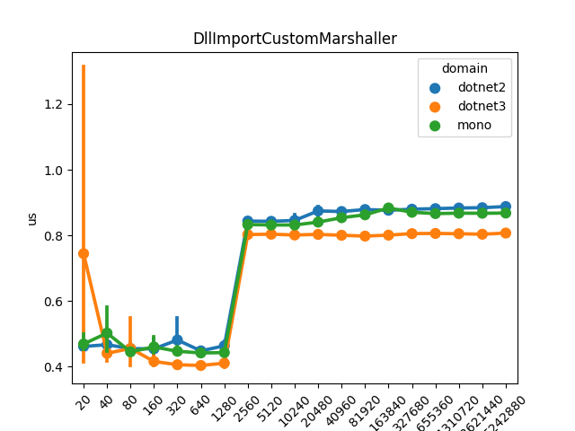
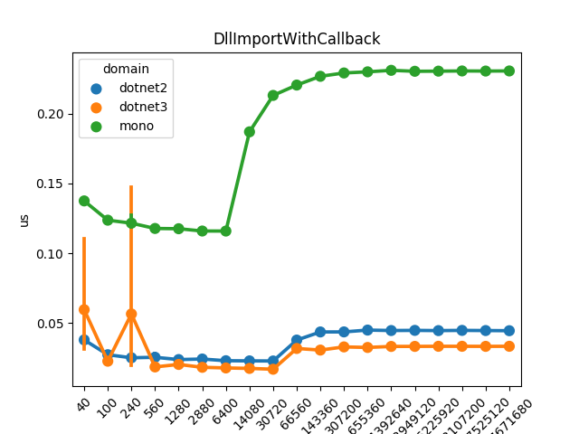

# Simple C# DllImport benchmarks

This is a set of simple benchmarks to estimate a baseline of the cost of common
scenarions when C# works with native code through `DllImport` & friends.

The test code runs a large number of operations and averages out over the
number of operations, as the resolution of [Stopwatch](https://docs.microsoft.com/en-us/dotnet/api/system.diagnostics.stopwatch?view=netcore-3.0) is not small enough.

## Requirements

* Mono >= 5.0
* Dotnet >= 3.0, with both `netcoreapp3.0` and `netcoreapp2.2` frameworks.
* python with pandas and seaborn for plotting the graphics

## Usage

```
$ make
$ make plot
```

## Results

These plots discard the initial iterations as they happen to be quite slow due
to the initial JIT'ing of the managed code. The `x` axis shows the number of
iterations and the `y` axis shows the average time per iteration in
microseconds.

* `ManagedStatic` - Simple call to an empty static method.



* `ManagedVirtual` - Simple call to a virtual instance method



* `DllImportDirect` - Call to `fprintf` redirect to `/dev/null`



* `DllImportCustomMarshaller` - Call to `fprintf` but using an empty `ICustomMarshaler` for the string being passed.



* `DllImportWithCallback` - Call to native `qsort` passing a C# callback.



## System

* Dell XPS 15 9560
* i7-7700HQ @ 2.8 GHz
* 32 GB RAM
* Ubuntu 19.10
* Mono JIT/`mcs` 6.4.0.198 from Mono's repo.
* `dotnet` 3.0.100 from Microsoft's repo, targeting `netcoreapp` both 2.2 and 3.0
